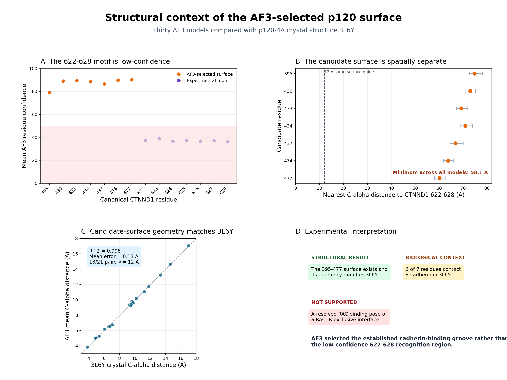

# IsoformPocket

An uncertainty-aware structural analysis of alternative protein isoforms using
AlphaFold models, experimental structures, independent pocket detectors, and
matched complex-prediction controls.

## Research question

Can alternative splicing create a supported small-molecule pocket or alter a
protein interaction surface?

Two systems are analysed:

- **PKM1 and PKM2** provide a positive control with a known isoform-specific
  region.
- **RAC1 and RAC1B** provide the discovery system. RAC1B contains a flexible
  19-residue insertion at positions 76-94.

The repository reports computational evidence and uncertainty. It does not
claim experimental binding, clinical relevance, or target validation.

## Study design

The analysis uses sequential evidence gates:

1. verify isoform sequences and residue mappings;
2. inspect local AlphaFold confidence and PAE;
3. compare predicted structures with experimental PDB entries;
4. require agreement between pyKVFinder and P2Rank for pocket claims;
5. repeat complex predictions with matched isoform controls and multiple seeds;
6. compare predicted contact surfaces with an experimental partner structure.

The preregistered null result is retained when a feature fails any gate.

## Results

| Analysis | Result | Interpretation |
|---|---|---|
| PKM1/PKM2 control | The alternative region is high-confidence and the global folds remain closely aligned. | The workflow detects a known isoform-dependent region. |
| RAC1B pocket search | A large pyKVFinder cavity is absent from P2Rank and RAC1B crystal structures. | No supported fixed pocket is present beside the insertion. |
| RAC1/RAC1B with p120 | All seed-level mean ipTM values are below 0.23. The seed-202 RAC1B pattern fails replication at seeds 303 and 404. | The models do not define a stable or isoform-exclusive complex. |
| p120 structural mapping | The AF3-selected surface matches 3L6Y geometry with R^2 = 0.998 and 0.13 A mean distance error. | The surface exists, but this does not establish RAC binding. |
| Experimental motif comparison | The selected surface is at least 58.1 A from CTNND1 622-628. Six of seven selected residues contact E-cadherin in 3L6Y. | AF3 selected the established cadherin-binding groove instead of the low-confidence recognition region. |

## Primary conclusion

The RAC1B insertion does not create a fixed pocket supported by independent
methods and experimental structures. The matched AlphaFold complex analysis
also does not support a RAC1B-specific p120 interface.

The complex predictions preferentially place RAC proteins against p120's
structured cadherin-binding groove. The experimentally implicated CTNND1
622-628 segment is unresolved in 3L6Y and has low AF3 residue confidence. This
case shows how a complex model can select an established structured groove when
the relevant recognition element is disordered.



## Repository structure

```text
config/        Target, region, partner, and experimental-structure definitions
data/          Local source data and download manifests
scripts/       Download, analysis, validation, and figure-generation code
tests/         Unit tests for sequence, geometry, and AF3 helper functions
docs/          Study design and phase-specific decisions
results/       Tables, reports, and publication-style figures
```

Large downloaded files are excluded from Git. `data/manifest.json` records the
source URLs and SHA-256 checksums for the initial sequence and structure inputs.

## Installation

Python 3.11 or later is recommended.

```powershell
python -m venv .venv
.venv\Scripts\python.exe -m pip install --upgrade pip
.venv\Scripts\python.exe -m pip install -r requirements.txt
```

P2Rank 2.5.1 and a portable Java 17 runtime are installed by the supplied setup
script. The script checks pinned SHA-256 values before extraction.

```powershell
python scripts/setup_p2rank.py
```

## Reproduction

### Sequence, confidence, and structural comparison

```powershell
python scripts/fetch_inputs.py
python scripts/verify_manifest.py
python scripts/analyze_inputs.py
python scripts/compare_structures.py
```

### Pocket analysis

```powershell
.venv\Scripts\python.exe scripts/detect_cavities.py
python scripts/run_p2rank.py
python scripts/summarize_p2rank.py
.venv\Scripts\python.exe scripts/validate_cavities.py
.venv\Scripts\python.exe scripts/make_figures.py
```

### Interface chemistry

```powershell
python scripts/analyze_interface_features.py
```

### Multi-seed AlphaFold Server analysis

Download the six AlphaFold Server jobs listed in
[`data/alphafold_server/README.md`](data/alphafold_server/README.md), then run:

```powershell
.venv\Scripts\python.exe scripts/analyze_af3_multiseed.py
```

This command regenerates the model table, seed summary, residue-contact table,
report, and Figure 7 from all 30 models.

### Experimental mapping of the p120 surface

Download the official 3L6Y mmCIF file to
`data/raw/experimental/3L6Y.cif`:

```powershell
Invoke-WebRequest -Uri "https://files.rcsb.org/download/3L6Y.cif" -OutFile "data/raw/experimental/3L6Y.cif"
.venv\Scripts\python.exe scripts/map_p120_hotspot.py
```

This command regenerates the p120 geometry tables, E-cadherin interface
comparison, structural report, and Figure 8.

### Tests

```powershell
python -m unittest discover -s tests -v
```

## Main outputs

- [`results/consensus_pocket_report.md`](results/consensus_pocket_report.md)
- [`results/experimental_validation_report.md`](results/experimental_validation_report.md)
- [`results/af3_multiseed_report.md`](results/af3_multiseed_report.md)
- [`results/p120_hotspot_geometry_report.md`](results/p120_hotspot_geometry_report.md)
- [`results/figures/figure7_af3_multiseed_reproducibility.png`](results/figures/figure7_af3_multiseed_reproducibility.png)
- [`results/figures/figure8_p120_hotspot_structural_mapping.png`](results/figures/figure8_p120_hotspot_structural_mapping.png)

## Experimental follow-up

The computational results support a limited validation panel:

- p120 wild type versus p120 deletion of residues 622-628;
- RAC1 and RAC1B as matched isoform controls;
- RAC1B E78A, D83A, and D90A to test insertion electrostatics;
- pull-down or co-immunoprecipitation readouts with expression controls.

The CTNND1 395-477 residues are not prioritised for RAC mutagenesis because they
overlap the E-cadherin-binding groove and may confound interpretation.

## References

- Orlichenko et al. The 19-amino acid insertion in Rac1b confers specific
  binding to p120 catenin. *J Biol Chem* (2010).
  https://doi.org/10.1074/jbc.M109.099382
- Ishiyama et al. Dynamic and static interactions between p120 catenin and
  E-cadherin regulate the stability of cell-cell adhesion. *Cell* (2010).
  https://doi.org/10.1016/j.cell.2010.01.017
- RCSB PDB 3L6Y: https://www.rcsb.org/structure/3L6Y

## License

Code is released under the MIT License. Downloaded data retain their original
licenses and terms of use.

